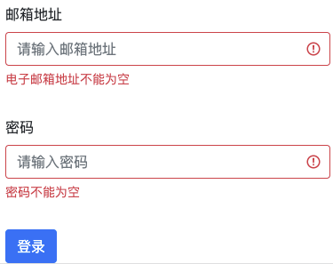

当点击按钮时，进行地址和密码的验证，如果不符合规则时都要提醒

```ts
const emailReg =
  /^[a-zA-Z0-9.!#$%&’*+/=?^_`{|}~-]+@[a-zA-Z0-9-]+(?:\.[a-zA-Z0-9-]+)*$/;

const inputRef = reactive({
  val: props.modelValue || "",
  error: false,
  message: "",
});

/*
 * 如果验证都通过 allPassed 为 true 否者为 false
 * every 函数会返回第一个 false
 */
const fnc = () => {
  if (props.rules) {
    const allPassed = props.rules.every((rule) => {
      let passed = true;
      inputRef.message = rule.message;
      switch (rule.type) {
        case "required":
          passed = inputRef.val.trim() !== "";
          break;
        case "email":
          passed = emailReg.test(inputRef.val);
          break;
        default:
          break;
      }
      return passed;
    });
    inputRef.error = !allPassed;
    return allPassed;
  }
  return true;
};

// ...

// 监听事件：收集验证函数：
const funcArr = [];
funcArr.push(fnc);

// 处理：使用 map 是将每个函数都执行一下，然后在判断验证有没通过。
const result = funcArr.map((func) => func()).every((result) => result);
```
